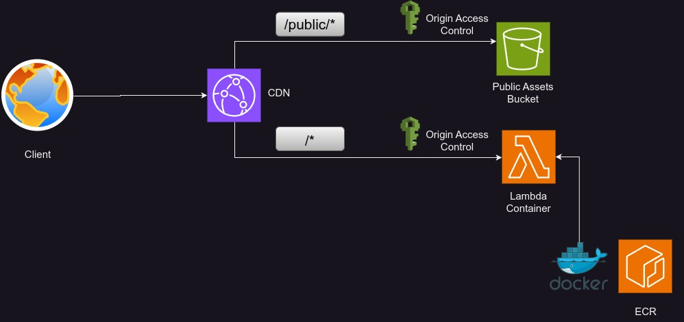

#  Gothic Framework

## 🚀 Build Modern Web Apps with Ease

**Gothic Framework** is a developer-first toolset built to help you craft fast, scalable, and modern web applications using the **GOTTH stack**:  
**Golang**, **TailwindCSS**, **Templ**, and **HTMX**.

Inspired by frameworks like **Next.js**, Gothic Framework brings powerful full-stack features to Go developers — including edge-ready architecture, SEO enhancements, and a fantastic development experience (DX).

---

## 🧠 Why Gothic?

Gothic Framework was built to make **Go-based web development** simpler, faster, and more productive without sacrificing performance or modern UX standards.

Whether you're launching a SaaS, building internal tools, or prototyping something new — Gothic Framework has your back.

---

## ⚙️ Effortless Deployment, Powerful Infrastructure

Gothic Framework comes with built-in AWS SAM integration, making deployment to the cloud **as simple as a single command**. Focus on your app’s features and logic — not on cloud setup or DevOps headaches.

---

## 🔥 Features Inspired by Next.js

### 🖼️ SEO-Optimized Image Loading  
Like the Next.js Image component, Gothic Framework lazy-loads images for better performance and user experience. A low-res placeholder is swapped with the full image after load — smooth and fast.

### 🌐 Static CDN Caching  
Static pages can be cached at **CloudFront edge locations** for blazing-fast performance — with cache TTLs of up to **1 year**!

### ♻️ Incremental Static Regeneration (ISR)  
Rebuild only the parts of your app that change. Gothic Framework lets you specify revalidation intervals — from seconds to **a full year**.

### 🙅‍♀️ Custom 404 Pages  
Craft personalized 404 pages to guide users gracefully when something goes missing.

### ⚡ Link Prefetching  
Just like in Next.js, Gothic Framework prefetches pages on **mouseover** so they load instantly on click. That’s snappy navigation!

### 🔁 Hot Reloading  
Make a change, save, and see it live instantly. No rebuilds. No restarts. Just code.

### 📡 API Routes with JSON  
Define backend logic with ease. Gothic Framework supports API routes for JSON payloads out of the box — perfect for building APIs alongside your frontend pages.

### 🧩 File-Based Routing  
Drop your components into `/pages`, `/components`, or `/api` — and Gothic automatically maps them to routes. Simple and intuitive.

---

## 🧪 Try Gothic Today

Take your Go projects to the next level with a framework that speaks your language and supports modern best practices.
